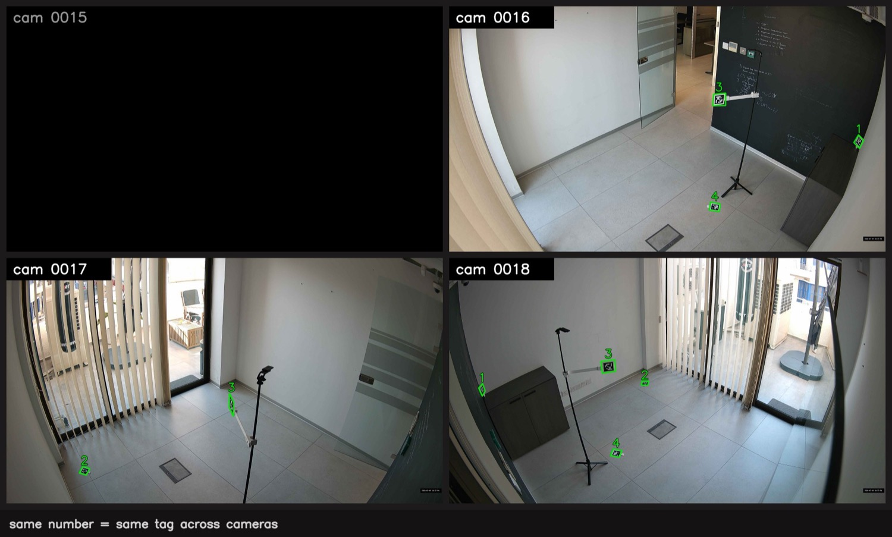

# apriltag-cam-pairs

A utility for multi-camera detection of **AprilTag (tag36h11)** markers. In a
single run it captures a 4K frame from every configured camera, detects the
markers, and produces JSON: for each pair of cameras it lists the marker IDs
visible to both cameras, together with the marker centre coordinates on each
frame.

Each marker carries a `placement` field: `floor` for even IDs and `elevated`
for odd IDs.

Deployment settings (cameras, IP addresses, credentials) live in `config.yaml`
and are not hard-coded.

## Example output

Each marker is outlined in green following its shape, with the ID printed above.
The same number on different cameras denotes the same marker, so the
correspondence is obvious at a glance. Camera `0015` is unavailable (shown as a
black tile); the program keeps running and computes the remaining pairs.



```bash
python cam_pairs.py --pretty
```

```json
{
  "pairs": [
    {"cameras": ["0015", "0016"], "tags": []},
    {"cameras": ["0015", "0017"], "tags": []},
    {"cameras": ["0015", "0018"], "tags": []},
    {"cameras": ["0016", "0017"], "tags": [
      {"id": 3, "placement": "elevated", "0016": {"x": 2376.29, "y": 819.83}, "0017": {"x": 1981.65, "y": 1292.07}}
    ]},
    {"cameras": ["0016", "0018"], "tags": [
      {"id": 1, "placement": "elevated", "0016": {"x": 3607.0, "y": 1189.16}, "0018": {"x": 292.87, "y": 1160.88}},
      {"id": 3, "placement": "elevated", "0016": {"x": 2376.29, "y": 819.83}, "0018": {"x": 1403.08, "y": 956.54}},
      {"id": 4, "placement": "floor", "0016": {"x": 2340.97, "y": 1768.0}, "0018": {"x": 1471.89, "y": 1719.98}}
    ]},
    {"cameras": ["0017", "0018"], "tags": [
      {"id": 2, "placement": "floor", "0017": {"x": 688.58, "y": 1874.04}, "0018": {"x": 1723.63, "y": 1103.68}},
      {"id": 3, "placement": "elevated", "0017": {"x": 1981.65, "y": 1292.07}, "0018": {"x": 1403.08, "y": 956.54}}
    ]}
  ],
  "errors": {
    "0015": "HTTP 000 / not a valid JPEG"
  }
}
```

The image above is produced by a separate utility, `draw_grid.py`, which is not
part of the repository. `cam_pairs.py` returns JSON only.

## Installation

```bash
git clone <repository> && cd apriltag-cam-pairs
./setup.sh                            # virtual environment and dependencies
cp config.example.yaml config.yaml    # set your cameras and credentials
export CAM_PASSWORD='<password>'
./.venv/bin/python cam_pairs.py --pretty
```

## Requirements

- **Python 3.9+** and the dependencies from `requirements.txt` (installed by
  `setup.sh` into `.venv`): `numpy<2`, `opencv-contrib-python`,
  `pupil-apriltags`, `PyYAML`.
- **`curl`** (usually already present).
- **Access to the camera network.** By default the tool assumes the VPN tunnel
  is managed externally and already up (for example, WireGuard as a system
  service: `systemctl enable --now wg-quick@<interface>`); the tool only checks
  reachability. If the cameras are unreachable, it reports an error (see `--log`).

## Configuration (`config.yaml`)

```yaml
cameras:                 # identifier: IP address
  "0015": 192.168.12.101
  "0016": 192.168.12.102
credentials:
  user: admin
  password: ${CAM_PASSWORD}
vpn:
  auto_bring_up: false   # true — the tool brings the tunnel up (needs interface and config_path)
```

## Usage

| Command | Description |
|---------|-------------|
| `python cam_pairs.py` | JSON only, on stdout |
| `python cam_pairs.py --pretty` | Indented JSON |
| `python cam_pairs.py --log` | Also print progress and errors to stderr |
| `python cam_pairs.py --keep-images` | Keep captured frames in `./shots` (deleted by default) |
| `python cam_pairs.py --out result.json` | Write JSON to a file |
| `python cam_pairs.py --cameras 0015,0016` | Restrict the set of cameras |

The main 4K stream is always used. No JSON means an error; rerun with `--log` to
see the reason.

## Output format

A marker appears in a pair only if both cameras of the pair detected it.
Coordinates are in pixels; the origin is the top-left corner of each camera's
frame. Unavailable cameras are listed in the `errors` object, and the remaining
pairs are computed as usual. On error, an object `{"error": "..."}` is returned
instead of the result.
